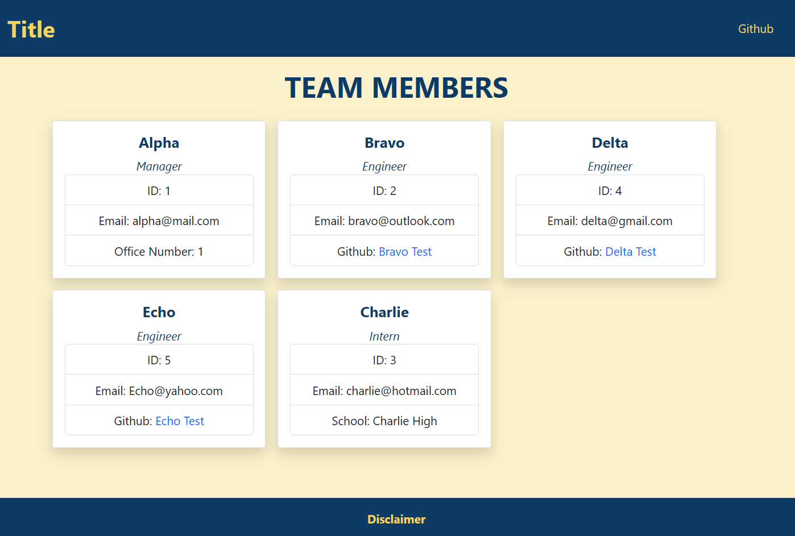

# Team Profile Generator [](https://opensource.org/licenses/MIT)

https://github.com/KKWChao/README-generator 

## Contents
- [Description](#description)
- [Installation](#installation)
- [Usage](#usage)
- [Contributing](#contributing)
- [Tests](#tests)
- [Contact](#contact)

## Description

Output<br>


A team profile generator that gets the input from the command line and creates the html page for the team. <br>
It requires the user to input the name, id, and email. Which then is followed by the a list choice of positions. <br>
Once the user has finished adding as many employees they desire to the page, it will then announce the index.html creation <br>

## Installation
```
git clone https://github.com/KKWChao/README-generator

npm init

npm install inquirer
```

## Usage

Up to user discretion

## Contribution

University of Berkeley Coding Bootcamp <br>
Me

## Contact

#### Github

https://github.com/KKWChao

### Email

Available upon request